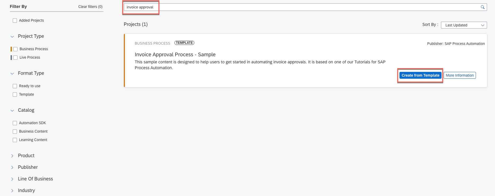

## Table of Contents
- [Table of Contents](#table-of-contents)
- [Acquire a Template Project from the Store ](#acquire-a-template-project-from-the-store-)
 - [Explore the store ](#explore-the-store-)
 - [Acquire a Project ](#acquire-a-project-)

# 1. Acquire a Template Project from the Store 

In this exercise, you will learn:
- How to explore content in the SAP Process Automation Store.
- How to reuse a package from the Store in the Application Development.

## 1. Explore the store 

>The Store offers predefined content for your automation. Packages are categorized by catalog which let you choose between Business Content, Learning Content and Automation SDK.

1.	Navigate to the store in your SPA Tenant, to find project template.

  

## 2. Acquire a Project 

1. Acquire the Invoice Approval Process - Sample application package:
- Search for **Invoice Approval Process - Sample**,
- Select **Create from Template** button.

  

2.	Create a Business Process Project:
- Under Project Name field type: **Invoice Approval Process AD160-XXX** (replace `XXX` with your User ID to identify project later),
- Under Short Description: Invoice Approval Process
- Choose **Create**.

  

4. To see the newly created project, navigate back to Lobby from the top menu.

  

## Summary

You've now acquired the project from the SAP Process Automation Store.

Continue to - [04](../ex1/README.md)
