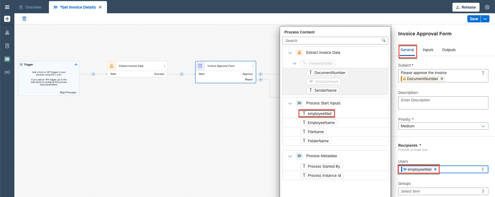
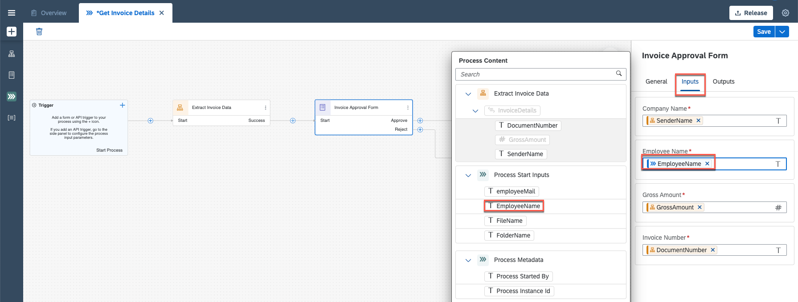

## Table of Contents
 - [Overview](#overview)
 - [Modify the Project](#modifyProject)
 - [Create an API Trigger for Process](#configureInputs)
 - [Map API parameters to Process parameters](#mapParameters)
 - [Summary](#summary)

### Overview 

In this exercise you will learn:

- Configure the API Call to Trigger Process
- Modify the Process to map the other artifacts
- Map Automation and Process parameters.

## 1. Modify the Project 

1. Open your project Invoice Approval Process AD160-XXX. Choose process **Get Invoice Details**.

 

2. From the **Editable** version of the go to the **Invoice Request Form**, choose 3 dots and choose **Remove** to delete the form.

 

## 2. Create an API Trigger for Process 

1. Click on the **Canvas** in the background.

 

2. Choose **Configure Inputs** in **Inputs** to configure inputs.

 

3. Configure three inputs. Enter the names and choose types.

    |  **Name**    | **Type**
    |  :------------- | :-------------
    |  `fileName`       | string
    |  `folderName`     | string
    |  `employeeName`   | string
    |  `employeeMail`   | string

    **Apply** changes.

 

4. Select Project Properties.

 

5. Choose **Configure Agent Version** and select Agent 3.7.XX and **Save**.

 

6. Choose **Dependencies** and select **Add Dependency** button.

 

7. Under **Package** select **Document Management Repository**.

 

8. Select **Add** button.

 

8. **Close** the Project Properties window.

 

> With this package you can automate some operations on your Document Management Service repository.

## 3. Map API parameters to Process parameters 

1. Select **Invoice Approval form** and map:
- under General: map **employeeMail** with Users

  

- under Inputs: map **Employee Name** with **employeeName**.

  

2. Select **Invoice Approval Notification Form** under General: map **employeeMail** with Users.

  

3. Select **Invoice Reject Notification Form** under General: map **employeeMail** with Users.

  

4. **Save** changes.

  

## Summary 

You've now created API Triggers for the Business Process.

Continue to - [Exercise 5 - Modify the Automation](../5_ModifyAutomation/Modify-automation.md)
