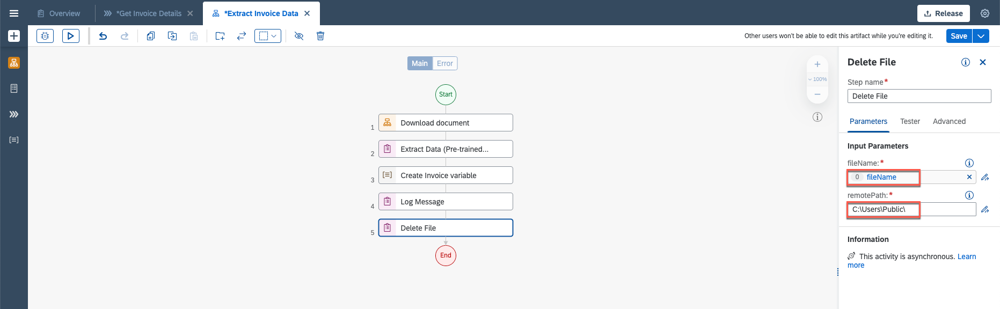
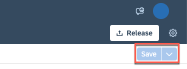

# Add an automation to the process

In this exercise you will learn:
- How to modify and add an automation

## 1. Modify the Project

10. Once the dependency is completed, go to **Extract Invoice Data**, select three dots, and choose **Open Editor**

  

11. Modify parameters in **Input/Output**.
- Rename **FilePath** to **fileName**
- Select **Add new input parameter** and name it **folderName**

  

    After changes the parameters should look like this:
  

12. Go to the **Tools**, select **Automations** and drag and drop **Download document**.

  

13. Map Input Parameters.
- Select **Edit Expression**
  
- Under **Variables** map accordingly and select **Save Expression**:
|  **Name**    | **Type**
|  :------------- | :-------------
|  `uploadedFileName`       | `fileName`
|  `folderName`     | `folderName`

  
- outputPath needs to hard-coded: "C:\\Users\\Public\\" + Step0.FileName

14. Click on the **Canvas** in the background.

  

15. Under **Tools** search for the Activity **Delete File**, drag and drop it.

  

16. Under **Delete File** Step edit Input Parameters:
- map fileName with fileName
- under remotePath type: C:\Users\Public\

  

17. Map Inputs under Extract **Invoice Data**.

    |  **Name**    | **Type**
    |  :------------- | :-------------
    |  `fileName`       | `fileName`
    |  `folderName`     | `folderName`

  

19. Map Inputs under Under **Invoice Approval form**.

  

17. **Save** changes.

  

## Summary

You've now modified the project.

Continue to - [06](../ex3/run-release-deploy.md)
