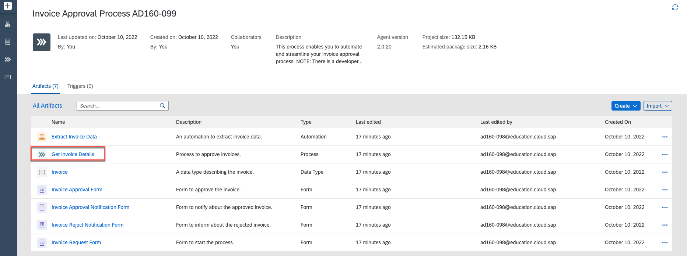

# Add an automation to the process

In this exercise you will learn:
- How to modify and add an automation

## 1. Modify the Project

1. Open your project. Choose process **Get Invoice Details**

  

2. From the **Editable** version of the go to the **Invoice Request Form**, choose 3 dots and choose **Remove** to delete the form.

     

3. Click on the **Canvas** in the background.

     

4. Choose **Configure Inputs** in **Inputs** to configure inputs.

     

5. Configure three inputs. Enter the names and choose types.

    |  **Name**    | **Type**
    |  :------------- | :-------------
    |  `fileName`       | string
    |  `folderName`     | string
    |  `employeeName`   | string

    **Apply** changes.

     

6. Select Project Properties.

     

7. Choose **Configure Agent Version** and select Agent 2.0.22 or higher and **Save**.

     

8. Choose **Dependencies** and select **Add Dependency** button.

     

9. Under **Package** select **Document Management Repository**.

     

    Select **Add** button and close the Project Properties window. Close the window.

     

10. Once the dependency is completed, go to **Extract Invoice Data**, select three dots, and choose **Open Editor**

     

11. Modify parameters in **Input/Output**.
- Rename **FilePath** to **fileName**
- Select **Add new input parameter** and name it **folderName**

     

    After changes the parameters should look like this:
     

12. Go to the **Tools**, select **Automations** and drag and drop **Download document**.

     

13. Map Input Parameters.
- Select **Edit Expression**
     
- Under **Variables** map accordingly and select **Save Expression**:
|  **Name**    | **Type**
|  :------------- | :-------------
|  `uploadedFileName`       | `fileName`
|  `folderName`     | `folderName`

     
- outputPath needs to hard-coded: "C:\\Users\\Public\\" + Step0.FileName

14. Click on the **Canvas** in the background.

     

15. Under **Tools** search for the Activity **Delete File**, drag and drop it.

     

16. Under **Delete File** Step edit Input Parameters:
- map fileName with fileName
- under remotePath type: C:\Users\Public\

     

17. Map Inputs under Extract **Invoice Data**.

    |  **Name**    | **Type**
    |  :------------- | :-------------
    |  `fileName`       | `fileName`
    |  `folderName`     | `folderName`

     

19. Map Inputs under Under **Invoice Approval form**.

     

17. **Save** changes.

     

## Summary

You've now ...

Continue to - [Exercise 3 - Excercise 3 ](../ex3/README.md)
