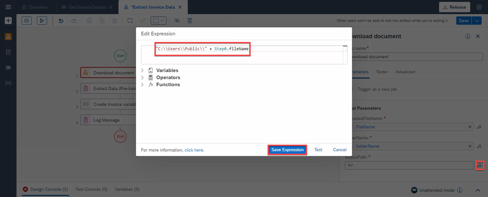

## Table of Contents
 - [Overview](#overview)
 - [Modify the Automation](#modifyAutomation)
 - [Map Automation parameters to Process parameters](#mapParameters)
 - [Summary](#summary)

### Overview 

In this exercise you will learn:

- How to modify and add an automation as a dependency.

The pre-built automation extracts the data from the Invoice document using AI.

## Modify the Automation 

1. Once the dependency is completed, choose **Extract Invoice Data**, select three dots, and then **Open Editor**.

    

2. In **Automation Details**, go to **Input/Output** to modify the parameters.

- Rename **FilePath** to **fileName**.
- Select **Add new input parameter** and name it **folderName**.

    

    After the changes the parameters should look like this:

    

3. Now go **Tools**, select **Automations** and drag and drop the **Download document** automation into the canvas, just before **Extract Data** activity.

    

4. Select **Download document** automation.

5. You will now map the **Input Parameters**. Select **Edit Expression** next to **uploadedFileName** field.

    

6. Map with variable **fileName** and select **Save Expression**.

    

7. Select **Edit Expression** next to **folderFileName** field.

    

8. Map with variable **folderName** and select **Save Expression**.

    

9. The **outputPath** needs to be hard-coded:
    <pre> "C:\\Users\\Public\\" + Step0.fileName </pre>

    > To do so please do not copy and paste the code directly in the **outputPath** field but open the expression editor where you can edit the expression.

10. Open the expression editor and copy the code.

11. Choose **Save Expression**

    

    

12. Click on the **Canvas** in the background.

    

13. Under **Tools** search for the activity **Delete File**, drag and drop it into the canvas, just below **Log Message** activity.

    

14. Select the activity **Delete File**.

    

15. Under **Delete File**, edit the **Input Parameters** as follows:
- Map **fileName** with **fileName**
- under **remotePath** type: C:\Users\Public\

    

16. Go to the process tab **Get Invoice Details**.

    

## Map Automation parameters to Process parameters 

1. Select **Extract Invoice Data** and map the following inputs:

- Map **fileName** with **fileName**.
- Map **folderName** with **folderName**.

    

2. **Save** your work.

## Summary 

You have now modified the project.

Continue to - [Exercise 6 - Release and Deploy Process](../6_ReleaseDeployProcess/Readme.md)
